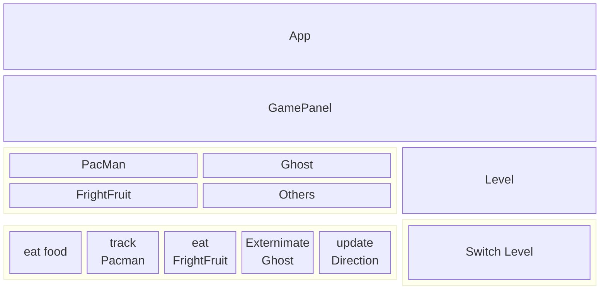

```
PacMan
├─ 📁.vscode
│  └─ 📄settings.json
├─ 📁pacman
│  ├─ 📁src
│  │  ├─ 📁main
│  │  │  ├─ 📁java
│  │  │  │  └─ 📁game
│  │  │  │     └─ 📁utils
│  │  │  │        ├─ 📄App.class
│  │  │  │        ├─ 📄App.java
│  │  │  │        ├─ 📄Block.java
│  │  │  │        ├─ 📄FrightFruit.java
│  │  │  │        ├─ 📄GamePanel.java
│  │  │  │        ├─ 📄Ghost.java
│  │  │  │        ├─ 📄Level.java
│  │  │  │        ├─ 📄PacMan.class
│  │  │  │        └─ 📄PacMan.java
│  │  │  └─ 📁resources
│  │  │     ├─ 📄FrightFruit.png
│  │  │     ├─ 📄FrontCover.png
│  │  │     ├─ 📄Ghost1.gif
│  │  │     ├─ 📄Ghost2.gif
│  │  │     ├─ 📄GhostScared1.gif
│  │  │     ├─ 📄GhostScared2.gif
│  │  │     ├─ 📄PacMan1.gif
│  │  │     ├─ 📄PacMan2down.gif
│  │  │     ├─ 📄PacMan2left.gif
│  │  │     ├─ 📄PacMan2right.gif
│  │  │     ├─ 📄PacMan2up.gif
│  │  │     ├─ 📄PacMan3down.gif
│  │  │     ├─ 📄PacMan3left.gif
│  │  │     ├─ 📄PacMan3right.gif
│  │  │     ├─ 📄PacMan3up.gif
│  │  │     ├─ 📄PacMan4down.gif
│  │  │     ├─ 📄PacMan4left.gif
│  │  │     ├─ 📄PacMan4right.gif
│  │  │     └─ 📄PacMan4up.gif
│  │  └─ 📁test
│  │     └─ 📁java
│  ├─ 📁target
│  │  ├─ 📁classes
│  │  │  ├─ 📁game
│  │  │  │  └─ 📁utils
│  │  │  │     ├─ 📄App.class
│  │  │  │     ├─ 📄Block.class
│  │  │  │     ├─ 📄FrightFruit.class
│  │  │  │     ├─ 📄GamePanel.class
│  │  │  │     ├─ 📄Ghost.class
│  │  │  │     ├─ 📄Level.class
│  │  │  │     └─ 📄PacMan.class
│  │  │  ├─ 📄FrightFruit.png
│  │  │  ├─ 📄FrontCover.png
│  │  │  ├─ 📄Ghost1.gif
│  │  │  ├─ 📄Ghost2.gif
│  │  │  ├─ 📄GhostScared1.gif
│  │  │  ├─ 📄GhostScared2.gif
│  │  │  ├─ 📄PacMan1.gif
│  │  │  ├─ 📄PacMan2down.gif
│  │  │  ├─ 📄PacMan2left.gif
│  │  │  ├─ 📄PacMan2right.gif
│  │  │  ├─ 📄PacMan2up.gif
│  │  │  ├─ 📄PacMan3down.gif
│  │  │  ├─ 📄PacMan3left.gif
│  │  │  ├─ 📄PacMan3right.gif
│  │  │  ├─ 📄PacMan3up.gif
│  │  │  ├─ 📄PacMan4down.gif
│  │  │  ├─ 📄PacMan4left.gif
│  │  │  ├─ 📄PacMan4right.gif
│  │  │  └─ 📄PacMan4up.gif
│  │  └─ 📁test-classes
│  └─ 📄pom.xml
└─ 📄README.md
```

## 代码思路

将游戏进行抽象，完成架构规划
考虑到游戏地图的设计很难在关卡难度上作为区分，不改变游戏的地图，关卡之间以 ghost 和 frightFruit 的数量以及 PacMan 和 Ghost 的移动速度来做区分


